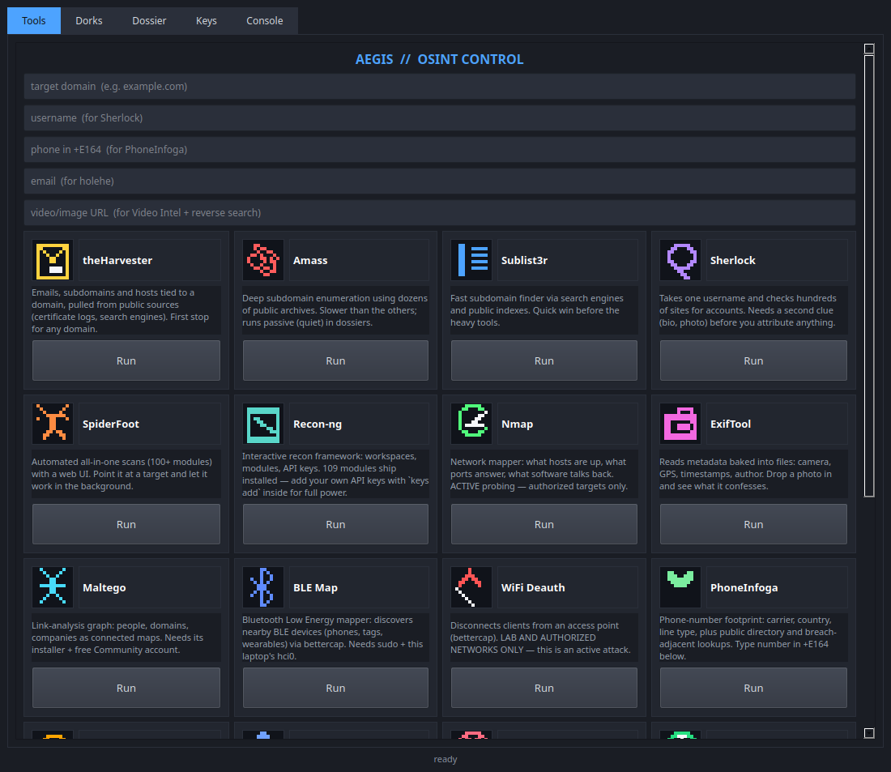
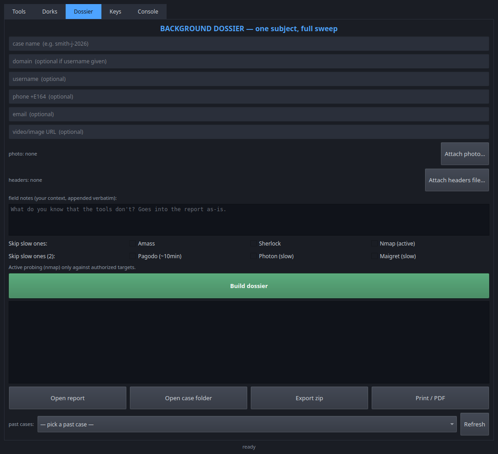
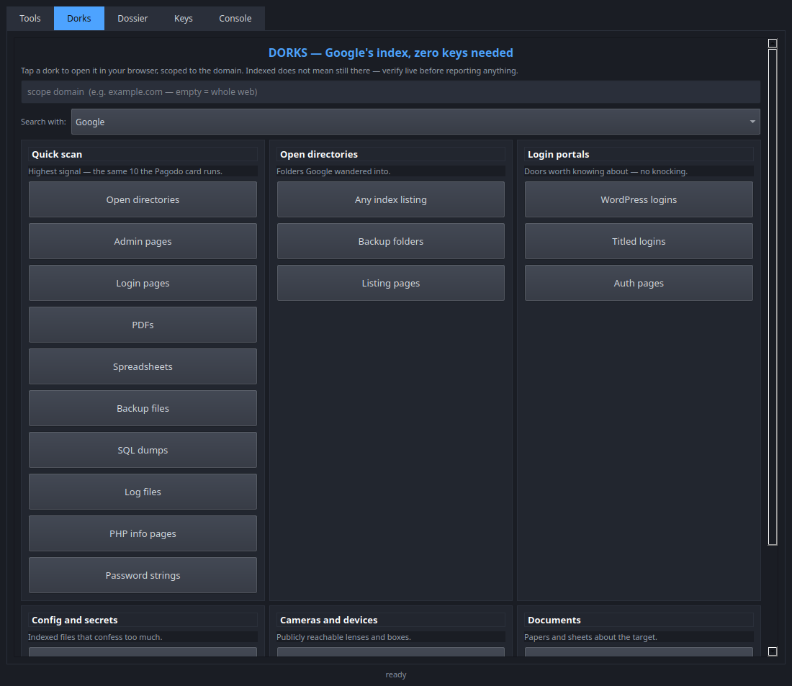

# AEGIS OSINT Panel — Field Manual


One-click control panel + background-dossier builder for OSINT field work.
20 tools, one window, no terminal spelunking required. Everything runs
user-local — no Kali repos, no system surgery, no paid dependencies.





## 30-second tour

- **Tools** — 20 pixel-icon cards (subdomains, usernames, ports, photos,
  dorks, archives, video, headers…). Type once up top, Run; output
  streams docked in the Console tab.
- **Dorks** — zero-key Google-dork pack × 4 engines. Pagodo automation
  for depth (tool #17).
- **Dossier** — one subject in, `REPORT.md` + styled HTML + zip out.
  Field notes, photo/headers attachments, case history.
- **Keys / Users / System** — 13-slot API vault, operator logins with
  per-tool grants, build-screen telemetry.

```bash
chmod +x install-osint-panel.sh && ./install-osint-panel.sh
# → 23-check self-test → double-click OSINT Panel
```

Full operator docs: [OPERATIONS-MANUAL.md](OPERATIONS-MANUAL.md).

## What you received

| File | What it is |
|---|---|
| `install-osint-panel.sh` | The installer. Run once. |
| `panel.py` | The control panel application. |
| `dossier.py` | The background-dossier engine (used by the panel). |
| `keys.py` | The API key vault backend (used by the panel). |
| `users.py` | Operator accounts + per-tool grants (login gate). |
| `README.md` | This manual. |
| `OPERATIONS-MANUAL.md` | Full per-section operator manual (also on Desktop). |
| `EDUCATOR.md` | Classroom one-pager: safe labs, role gates, 30-min lesson. |
| `LICENSE` | MIT for the panel code (tools keep their own). |

## Requirements

- Debian/Ubuntu/Linux Mint (tested on Mint 22.3), 64-bit, ~4GB free disk
- Real internet (the installer downloads ~2GB of tools)
- A `sudo` password (used ONCE, for: nmap, one display library, small utils)
- Python 3.10+ already on the system (check: `python3 --version`)

## Install (one command)

```bash
chmod +x install-osint-panel.sh && ./install-osint-panel.sh
```

What it does, in order: system packages (one sudo prompt) → Python tool
manager → all 20 tools installed **user-local** (`~/osint-tools`, `~/.local`,
`~/bin` — your system Python and apt sources are never modified and no Kali
repositories are added) → control panel + desktop icon.

It ends with a **self-test**: 23 PASS/FAIL lines covering tools + infra.

- All PASS → double-click **OSINT Panel** on the desktop.
- Any FAIL → see Troubleshooting below, then re-run the script (it skips
  everything already installed and resumes where it stopped).

## Daily use

**Login.** First launch creates the admin account. After that every
operator logs in; admins manage accounts in the Users tab (per-tool
grants + tab access — e.g. full access for trained operators,
gau-only for trainees). Passwords are hashed, never stored. Reports
are stamped with the operator name.

**Tools tab.** Type the target domain and/or username/phone/email once at the
top, then Run on any card. Each card carries a retro pixel icon for its
tool (drawn in code — no image files to lose). Hover any Run button for
what it needs.

**Dorks tab.** Dork pack that needs zero keys: six categories
(quick scan, open directories, login portals, config/secrets, cameras,
documents). Pick a search engine (Google, Bing, DuckDuckGo, Brave —
different rate-limit buckets, so a block on one never stops the pack),
tap any dork to open it in your browser, scoped to the domain
you typed (empty = whole web). The Quick-scan set is the same 10 dorks
the Pagodo card runs automatically.

**System tab.** Build screen: machine stats, panel version, bundle
manifest with dates, ThinkCentre link status. Refresh re-probes.

**Console tab.** Tool output runs docked inside the panel: live log, an
input line (type + Enter sends keystrokes to the running tool — recon-ng
commands work here), and a Stop button. Starting a second tool stops the
first. Three exceptions still open an external terminal: BLE Map and WiFi
Deauth (sudo needs a real TTY for the password prompt) and Maltego (its
own GUI app); the ExifTool card opens a file picker as before.

**Dossier tab.** The money feature: name a case, enter any subject identifiers
(domain, username, phone, email, video/image URL) and optionally attach a photo
or a headers file. Add **field notes** — what you know that the tools don't,
appended verbatim to the report. **Build dossier** runs the stack in sequence
with a live progress log, then compiles
`REPORT.md` + styled `REPORT.html` into `~/osint-tools/cases/`. **Export zip**
packages the whole case for handoff; **Print / PDF** opens the styled report
for browser printing. The **past-cases picker** reopens any previous case.
Gaps never abort a run — a failed tool becomes a logged gap, not a crash.

**Keys tab.** 13 API key slots (Shodan, GitHub, Censys, Hunter, VirusTotal…).
Paste keys once, **Deploy** writes them into recon-ng and theHarvester
configs on this machine only. Keys file lives at
`~/.config/aegis/keys.json`, readable by you alone. Most tools work without
keys; keys make them dramatically better.

## The tools (what each one is for)

| Tool | Answers |
|---|---|
| theHarvester | Emails, subdomains, hosts for a domain |
| Amass | Deep subdomain enumeration (slow, thorough) |
| Sublist3r | Fast subdomain sweep |
| Sherlock | Which sites a username is registered on |
| Maigret | Same, wider net (3000+ sites) |
| holehe | Which sites an email is registered on |
| SpiderFoot | Automated 100+ module scans, web UI on :5001 |
| Recon-ng | Interactive recon framework (109 modules; add API keys inside) |
| Nmap | Open ports + service versions (**authorized targets only**) |
| ExifTool | Metadata inside photos (attach a file, GPS highlighted) |
| gau | Historic URLs/endpoints for a domain |
| Pagodo | Google-Hacking-Database dorks scoped to a domain (slow, passive, no key) |
| Wayback | Internet Archive snapshots for a domain (list + latest in browser) |
| Video Intel | Video/image URL metadata via yt-dlp (no download) + Lens/TinEye buttons |
| Email Headers | Raw header route + SPF/DKIM/DMARC analysis (offline dialog) |
| Photon | Crawls a site for emails, subdomains, endpoints |
| PhoneInfoga | Carrier, country, line type + public lookups for a number |
| Maltego | Visual link-analysis graphs (needs installer + free account, see below) |
| BLE Map | Nearby Bluetooth devices via bettercap (needs sudo) |
| WiFi Deauth | Disconnect clients from an access point (**lab/authorized only**) |

## Rules of the road

1. **Active probing (nmap, deauth) only against systems you own or are
   explicitly authorized to test.** Everything else here reads public data.
   Every dossier report states this distinction in its Methods section.
2. **A hit is not an attribution.** A username or email match needs a second
   discriminator (bio, photo, location) before you attach a name to it.
3. **Keys stay on the machine.** Never paste the vault file into chats,
   tickets, or shared drives.

## Troubleshooting

**Installer FAIL line.** Re-run the script (it resumes). If one tool keeps
failing, install it with the panel closed and no VPN active, then re-run.

**Panel icon does nothing.** Run `python3 ~/osint-tools/panel.py` in a
terminal once — the real error prints there. Usual cause: the Qt display
library didn't install (`sudo apt install -y libxcb-cursor0`).

**SpiderFoot browser says "no connection".** The panel waits for the server
before opening the tab; on slow machines give it up to 90 seconds. If it
never loads, check nothing else sits on port 5001.

**Recon-ng opens with no modules.** Run once inside it:
`marketplace refresh` then `marketplace install all`. (The installer does
this; a wiped `~/.recon-ng` needs it again.) Remaining warnings are API
keys — add yours with `keys add`, or use the Keys tab.

**theHarvester "[!] Invalid source".** Source names change between versions.
Edit `HARVESTER_SOURCES` in `dossier.py` to sources your version lists
(`theHarvester -h` shows them).

Every module rides the dossier run: sublist3r, harvester, amass, sherlock,
maigret (top-100), nmap, phone, holehe, gau, pagodo (quick file), wayback,
photon, video, email headers — each with Findings + Methods entries, skippable
via checkboxes or `--skip`. Interactive/server/hardware tools stay out by
design (SpiderFoot, Recon-ng, BLE/Deauth, Maltego); the report says so.

**Pagodo comes back empty.** Google rate-limits automated searches (HTTP
429) — the panel says so in the card tooltip. Wait a while and retry, run
fewer dorks, or use the Dorks tab in a browser instead. Empty never means
clean: it means Google didn't answer.

**Archive says it's napping.** The Wayback card and dossier module detect the
Archive's offline page (served as HTTP 200) and say so instead of failing —
retry later, or use the browser fallback it opens.

**yt-dlp fails on a site.** Video platforms change constantly; update with
`python3 -m pip install --user -U yt-dlp` and retry. Metadata-only runs never
touch disk beyond the report.

**WiFi Deauth errors.** Install `iw` (`sudo apt install -y iw`), and let the
guided terminal finish: it steps NetworkManager aside (which otherwise
retakes the card mid-attack), enters monitor mode, then starts recon.
Channel-hopping for ~8 seconds is normal scanning; the target table prints
after. Restore with the command it prints at the end.

**Maltego.** Download the .deb from maltego.com/downloads,
`sudo dpkg -i <file>`, register the free Community account on first run.
The panel auto-launches it once installed.

**ExifTool shows nothing.** The photo genuinely has no metadata (many
messengers strip it). That negative result is itself a finding — note it.

## Uninstall

```bash
rm -rf ~/osint-tools ~/bin/amass ~/bin/gau ~/bin/bettercap \
  ~/bin/phoneinfoga ~/.recon-ng ~/.theHarvester ~/Desktop/OSINT-Panel.desktop
python3 -m pip uninstall -y sherlock-project holehe maigret PySide6
```

(System packages installed via apt are left alone deliberately.)

## Provenance

Every component downloads from its official upstream at install time; this
package ships no third-party binaries. Tool licenses belong to their
authors (notably: Amass OWASP, Nmap NPSL, Maltego commercial-with-free-tier).
Reports produced with this panel are your work — handle per your
authorization and data-handling rules.

## Built with Sable

*Created with help from **Sable** — a persistent AI instrument officer
with an Obsidian brain: filed experience it calls intuition. Crew,
not code.*
